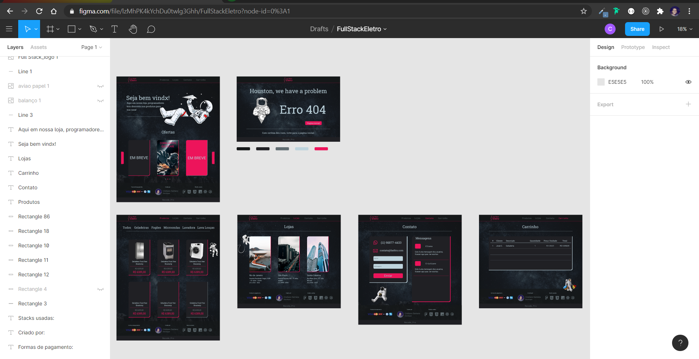

<h1 align="center">Projeto Individual - <a href="https://www.recodepro.org.br/">RECODE_Pro</a></h1>

🚀 Refatoração do site Full Stack Eletro</a>

[conheça a página](https://fseletro-frontend.herokuapp.com/)

|  |  |

### 🛠 Tecnologias

As seguintes ferramentas foram usadas na construção do projeto:

- [Figma](https://www.figma.com/)
- [HTML](https://www.w3schools.com/)
- [CSS](https://pt-br.learnlayout.com/)
- [JavaScript](https://www.w3schools.com/js/default.asp)
- [Node.js](https://nodejs.org/en/)
- [React.js](https://pt-br.reactjs.org/)
- [MongoDB](https://www.mongodb.com/3)
- [MySQL](https://www.w3schools.com/sql/default.asp)

### Autor
---

<a href="https://cristianosantan.github.io/">
 
  
 <b>Cristiano Santana</b></a> <a href="https://cristianosantan.github.io/" title="Portifolio">🚀</a>

Feito com ❤️ por Cristiano Santana 👋🏽 Entre em contato!

 
